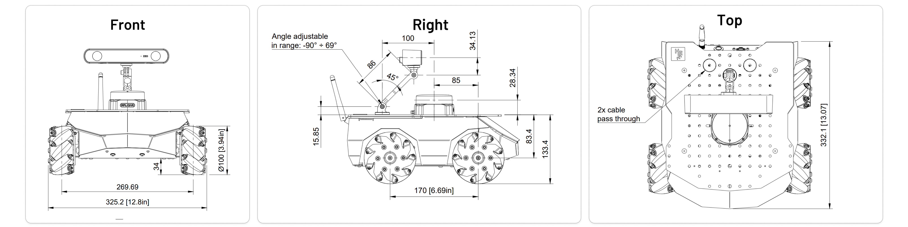
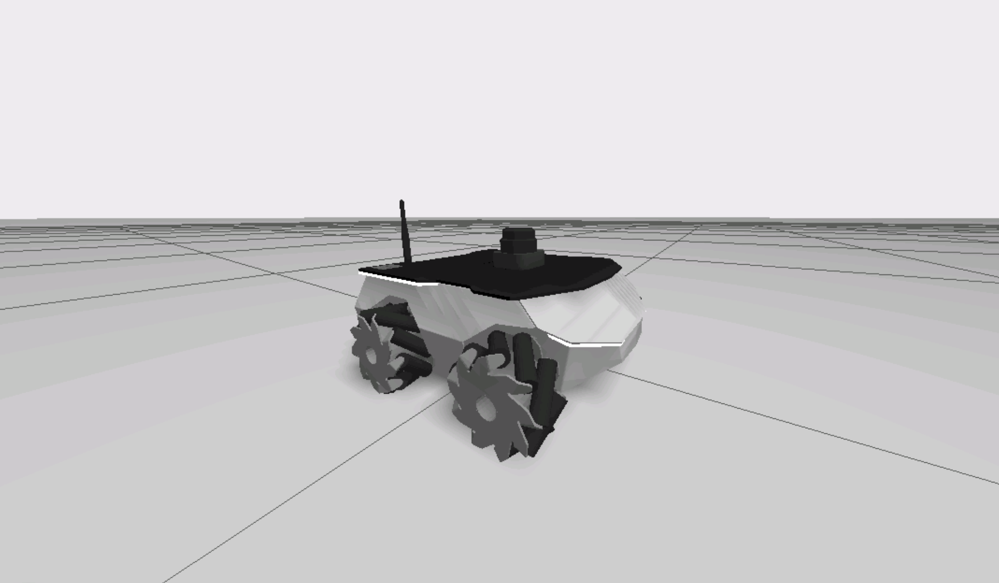
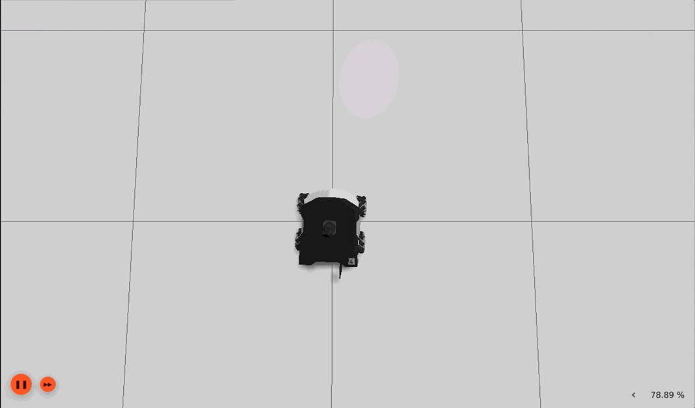
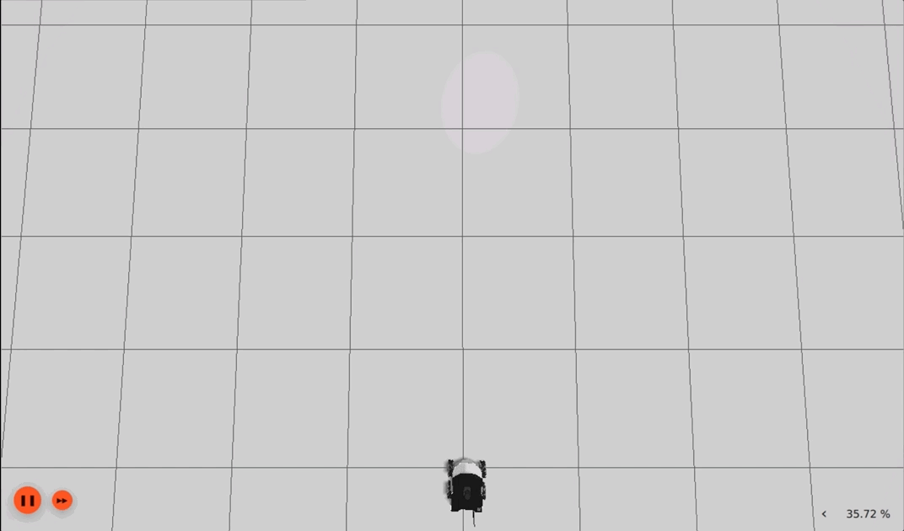
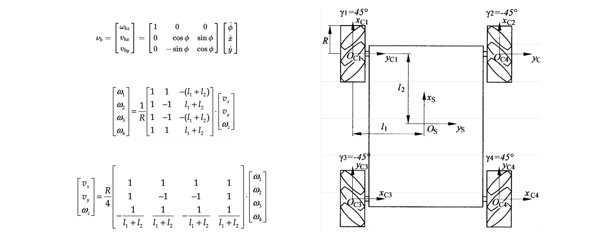

# Kinematic Model

The purpose of this project is to design the kinematic model of the `ROSBot XL` robot with the help of dimensions of the robot.



  

## Structure

```text
.
├── eight_trajectory
│   ├── launch
│   │   └── eight_trajectory.launch.py
│   ├── src
│   │   └── eight_trajectory.cpp
│   ├── CMakeLists.txt
│   └── package.xml
├── kinematic_model
│   ├── launch
│   │   └── kinematic_model.launch.py
│   ├── src
│   │   └── kinematic_model.cpp
│   ├── CMakeLists.txt
│   └── package.xml
├── wheel_velocities_publisher
│   ├── src
│   │   └── wheel_velocities_publisher.cpp
│   ├── CMakeLists.txt
│   └── package.xml
└── README.md
```

## Setup

#### Distribution

Use docker for quick-start (for both ROS1 or ROS2):

```bash
# using docker for ROS1
$ docker run -ti --rm --name local-ros-noetic ros:noetic
# using docker for ROS2
$ docker run -ti --rm --name local-ros-humble ros:humble
```

#### Build (Package)

Now, create a ros2 workspace, clone the package:

```bash
# setup directory
$ mkdir ~/ros2_ws/src/
$ git clone <repo_name> ~/ros2_ws/src/
```

Install the required packages (dependency) mentioned in `package.xml` using `apt`:

```bash
# check if package is available
$ ros2 pkg list
$ ros2 node list
# update path to installed packages
$ source /opt/ros/humble/setup.bash
```

To build locally or inside docker use the following commands:

```bash
# execute build
$ cd ~/ros2_ws && colcon build
$ source ~/ros2_ws/install/setup.bash
```

## Robot

The `ROSbot XL` is an autonomous mobile robot platform featuring a robust 4x4 drive and expandable with various devices, designed for ease of use with ROS/ROS 2 software, making it perfect for educational and research applications.



**Note:** Check more details about `ROSbot XL` from [here](https://husarion.com/manuals/rosbot-xl).

## Launch

To execute `kinematic_model` launch `kinematic_model.launch.py`.

```bash
$ ros2 launch kinematic_model kinematic_model.launch.py
```

The `kinematic_model` node will perform all these movements in this order.

```text
- move forward
- move backward
- move sideways to the left
- move sideways to the right
- turn clockwise
- turn counter-clockwise
```



To execute `eight_trajectory` node, launch `eight_trajectory.launch.py`.

```bash
$ ros2 launch eight_trajectory eight_trajectory.launch.py
```



## Specifications

#### Holonomic vs Non-Holonomic Robots

**Holonomic robots** possess the ability to move freely in any direction, independent of their current orientation. These systems meet all motion constraints directly through their coordinates, allowing them full control over their movement across all axes.

This characteristic is particularly advantageous in tightly constrained environments where precision and versatility are required, such as in automated warehouses or complex assembly lines.

**Non-holonomic robots** are constrained by motion restrictions that prevent them from moving directly towards all possible positions from a given configuration. These constraints often arise from the physical design, such as wheels that must roll without slipping, limiting movement to the forward direction and necessitating rotational maneuvers to change direction.

This type of robot is common in applications like vehicle navigation and mobile robot path planning, where the dynamics of movement are a critical factor in design and operation.

#### Kinematic Model

The `𝜈𝑏 = (𝜔𝑏𝑧,𝑣𝑏𝑥,𝑣𝑏𝑦)` the velocity of the chassis as the time derivative of the coordinates `˙q=(˙ϕ,˙x,˙y)` and `ωi = (𝜔1,𝜔2,𝜔3,𝜔4)` is the angular velocity of the wheel, while `l1` and `l2` are the distances between wheel axis and body center.



## Roadmap

- [x] Task 1 : Kinematic model of the ROSBot XL.
- [x] Task 2 : Motion in the absolute frame.

See the [open issues](https://github.com/llabhishekll/kinematic_model/issues) for a full list of proposed features (and known issues).

## Tools

System tool/modules used for project development.

- `Applications` : [vs-code](https://code.visualstudio.com/), [ros-extensions](https://marketplace.visualstudio.com/items?itemName=ms-iot.vscode-ros) and [docker-desktop](https://docs.docker.com/get-docker/).
- `ROS` : [ros-docker-images](https://hub.docker.com/_/ros/) (`humble`, `noetic`) or [build-source](https://www.ros.org/blog/getting-started/).

## License

Distributed under the MIT License. See `LICENSE.txt` for more information.
